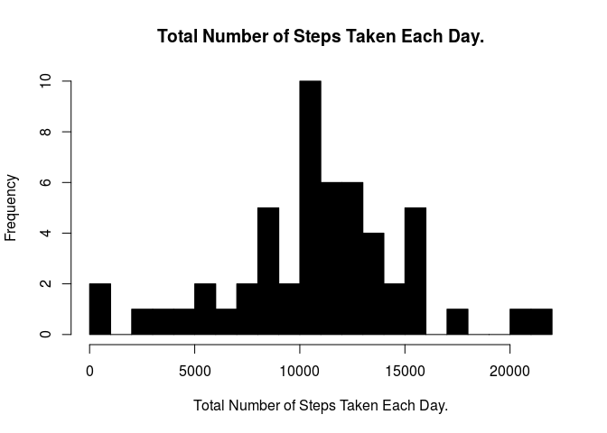
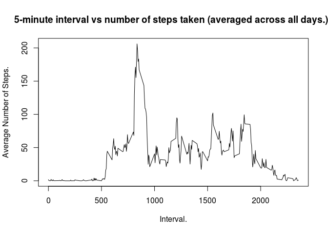
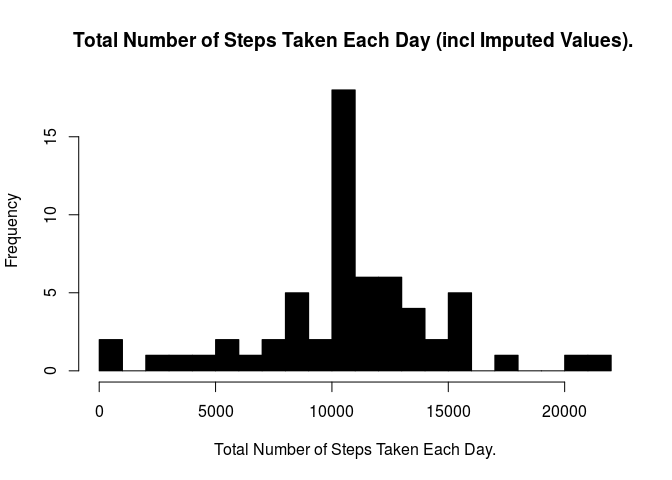
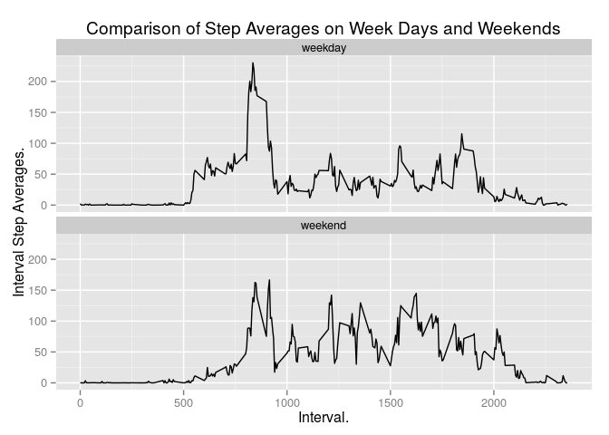

# Reproducible Research: Peer Assessment 1

## Loading and preprocessing.

The data was loaded into data frame *df1* as follows, and the date variable was transformed from a factor to a date. A second data frame, *df2*, which omits rows containing missing values, was created from the first data frame.


```r
df1 <- read.csv("activity.csv", header = TRUE)
df1$date <- as.Date(df1$date)
df2 <- na.omit(df1) # remove NA values
```


## What is mean total number of steps taken per day?

The code below uses the *plyr* package to create a *summ1* data frame that summarizes the *df2* data frame (with no missing values) by date and total number of steps per day. This is then plotted in a histogram.


```r
old.par <- par() # store the graphics parameters in case they need to be reset
library(plyr)
library(ggplot2)
summ1 <- ddply(df2, .(date), summarise, tot = sum(steps))
hist(summ1$tot, breaks = 30, col = "black", xlab = "Total Number of Steps Taken Each Day.", main = "Total Number of Steps Taken Each Day.")
```

 

### Calculate Mean and median number of steps per day.

```r
mean_no_steps <- mean(summ1$tot)
median_no_steps <- median(summ1$tot)
options(scipen=1, digits=2) # control the number of decimal digits
```

The **mean** number of steps per day is 10766.19 and the **median** is 10765. 


## What is the average daily activity pattern?

The following code makes a time series plot of the 5-minute interval and the average number of steps taken, averaged across all days.


```r
summ2 <- ddply(df2, .(interval), summarise, avg=mean(steps))
plot(summ2$interval, summ2$avg, type = "l", xlab="Interval.", ylab = "Average Number of Steps.", main = "5-minute interval vs number of steps taken (averaged across all days.)  ") 
```

 

### Maximum steps interval.


```r
max_interval <- summ2$interval[summ2$avg == max(summ2$avg)]
```

The code shown immediately above calculated the 5-minute interval which, on average across all the days in the dataset, contains the maximum number of steps as **835**.


## Imputing missing values

The total number of missing values in the dataset is calculated as follows:


```r
number_of_missing_values <- sum(is.na(df1[,])) # count the number of missing values
```

There are **2304** rows with missing values in the dataset.

#### Filling in missing values.

My strategy for filling in the missing values was to create an **index** *ind* of the missing values in the original data frame, and also to create a **summary data frame** *summary_df3* containing step averages for each of the 288 five minute intervals. 

I then used *join* to join the original and summary data frames on the *interval* variable. (I used join rather than merge so as to preseve the order.) I then updated the missing step values with the computed averages, but only for the values that the index told me were missing.

It's not a fancy or sophisticated approach but it was simple to design and understand and it gets the job done.

This approach gave me a new dataset, **join_df**, that is equal to the original dataset but with the missing data filled in.


```r
# Packages.

if(!require(plyr)){ # for the ddply summary
 install.packages("plyr")
 library(plyr)
}

# Copy the original dataset read in earlier to data frame.

df_with_nas <- df1

# Copy the data frame, removing missing values at the same time.

df_no_nas <- na.omit(df_with_nas) 

# Create a summary data frame with computed average steps by interval

summary_df3 <- ddply(df_no_nas, .(interval), summarise, avg=round(mean(steps)))

# Create a data frame index of the rows with missing values.

ind <- as.data.frame(which(is.na(df_with_nas), arr.ind = TRUE)) # ***** index missing

# Change the column name of the computed step average in the summary

colnames(summary_df3) <- c("interval","computed_avg")

# Join the original data frame with the summary data frame by interval.

join_df <- join(df_with_nas, summary_df3)
```

```
## Joining by: interval
```

```r
# Update the missing values with the computed average.

join_df[ind$row,]$steps <- join_df[ind$row,]$computed_avg

#remove the computed average column

join_df$computed_avg <- NULL
```

Using the data set with imputed missing values, the code below makes a a histogram of the total number of steps taken each day.


```r
summary_df4 <- ddply(join_df, .(date), summarise, tot=sum(steps))
hist(summary_df4$tot, breaks = 30, col = "black", xlab = "Total Number of Steps Taken Each Day.", main = "Total Number of Steps Taken Each Day (incl Imputed Values). ")
```

 

The **mean** number of steps per day is 10765.64 and the **median** is 10762. As a result of imputing the missing values, the mean has decreased slightly (from 10766.19) and the median has also decreased slightly (from 10765).

## Are there differences in activity patterns between weekdays and weekends?

The code below creates a variable to store whether the observation was taken on a weekday or a weekend. It them summarises the data by that variable and interval, calculating mean steps by interval. These are then plotted as shown below. 


```r
join_df$weekday_or_weekend <- weekdays(join_df$date)
join_df$weekday_or_weekend[join_df$weekday_or_weekend %in% c("Saturday","Sunday")]  <- "weekend"
join_df$weekday_or_weekend[join_df$weekday_or_weekend %in% c("Monday","Tuesday","Wednesday","Thursday","Friday")]  <- "weekday"

summ5 <- ddply(join_df, .(weekday_or_weekend, interval), summarise, avg=mean(steps))

plot1 <- ggplot(summ5, aes(x=interval, y=avg)) + geom_line() + facet_wrap(~weekday_or_weekend, ncol=1)
plot1 + ggtitle("Comparison of Step Averages on Week Days and Weekends") +
  xlab("Interval.") +
  ylab("Interval Step Averages.")
```

 

While the general pattern is the same, there does appear to be a difference between weekday and weekend activity, particularly in the early morning, when there is earlier and higher peak activity on the weekday. There appears to be a higher general activity on the weekend also though, reflecting perhaps that people are generally more inactive at work during the week.

**ENDS**
